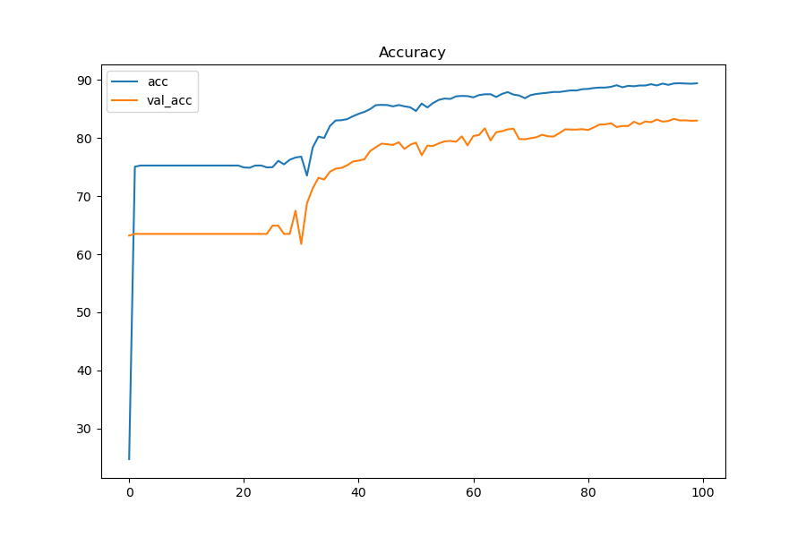
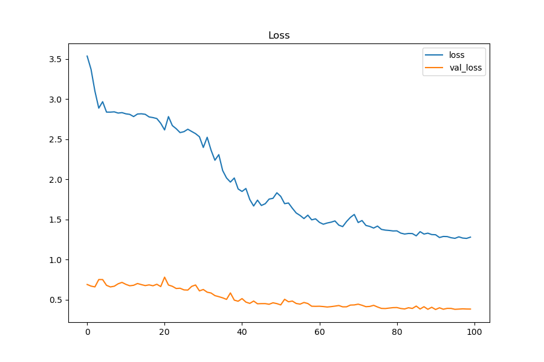
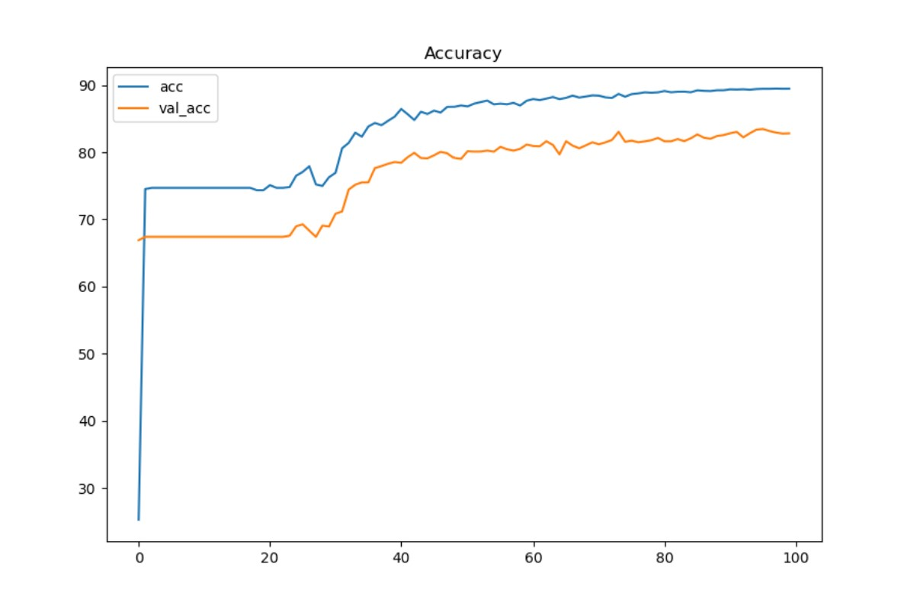
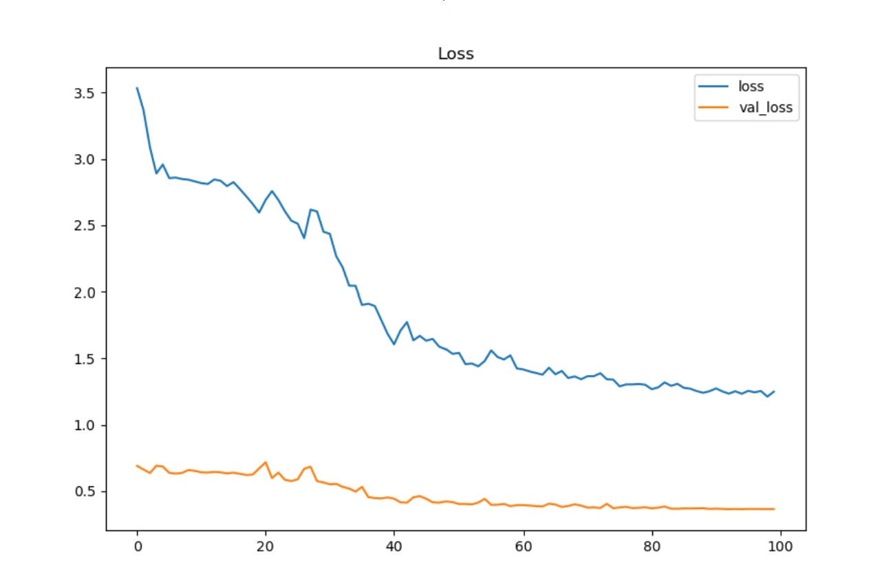
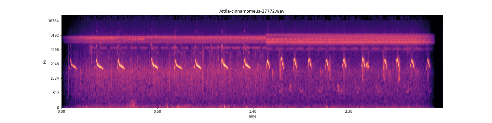

<strong>TweetyNet: Eco-Acoustic Event Detection Pipeline</strong>

&nbsp;&nbsp;&nbsp;&nbsp;&nbsp;&nbsp;&nbsp;&nbsp;&nbsp;&nbsp;&nbsp;&nbsp;[DSC180-A09-Eco-Acoustic-Event-Detection presentation](https://www.youtube.com/watch?v=7SjljRRrg2M)

 

  <strong>Introduction to Eco-acoustic Event Detection</strong>

 

#####	It is important to understand the health of the planet’s ecosystems in order to help conserve them. One way that has been employed to assess the health of ecosystems is audio event detection, which uses the sound generated by animals to detect their presence and indirectly gauge the health of an ecosystem and is the goal of the TweetyNet machine learning model. Audio event detection has benefited conservation efforts because it allows researchers to automate the task of detecting the presence of birds with the use of machine learning techniques. A brief example of audio event detection in everyday use is hands-free interfacing, which detects the presence of spoken voice commands in order to perform the desired action. Eco-acoustic event detection is audio event detection with the intended use of detecting sounds that are characteristic of an ecosystem and can be used to assess the health of ecosystems. One of the most useful indicators of an ecosystem’s health are bird vocalizations, which are relatively easy to separate from the background noise of an environment. The usefulness of detecting bird presence through their vocalizations presents a challenge, as manual inspection and annotation of audio data is a painstaking process. Through the use of machine learning, we can anticipate a reduction in time spent manually annotating and identifying birds’ vocalizations which will allow researchers to monitor and learn about ecosystems with greater accuracy and efficiency. Birds inhabit and share nearly every environmental niche and are more sensitive to ecological change than other kinds of animals and so are capable of representing the biodiversity of ecosystems disturbed by deforestation and climate change. By applying eco-acoustic event detection to birds, it can also be adapted to the detection of other so-called ‘indicator’ species. Beyond measuring ecological health, eco-acoustic detection can accumulate environmental information, refine our understanding, and reflect on the impact of human activity on our planet’s health. All of these goals are possible applications of the TweetyNet model.

 

    
<strong>Methodology</strong>

   

##### Machine learning paired with signal processing methods allows for audio data to be processed and learned as image data via conversion to Mel-spectrograms which can be used to train TweetyNet, a convolutional and recurrent neural net hybrid model built for the purpose of event detection in audio data [1]. Initial research for this model’s potential to be repurposed for eco-acoustic event detection presented itself as a challenge since there was no ready-to-use pipeline for replicating preliminary results. Many of the model’s methods discussed in the paper such as spectrogram windowing and data ingestion for audio of various lengths were not available aside from the neural network architecture which was available in the original author’s Github repository. The model has been replicated using the paper Pytorch and adapted to use both CPU and GPU processing. Audio data ingestion has also been generalized to intake various lengths of recordings from various species for the purpose of diversifying extracted features of bird vocalizations in the convolutional layers as well as temporal dependent features learned in the recurrent layers [1]. This replicate model has proven itself an excellent potential tool for remote sensing as an eco-acoustic event detection method. When compared to published results that accurately detect the presence of bird vocalizations trained on high-quality annotations from 3 species [1]. Previous iterations of the replicate model have averaged accuracy of .6 - .65 to now .88-.89, which is well within the range of accuracy discussed in the results of the published work [1].
 

<strong>Neural Network Learning Process</strong>

Analysis of training process for Attila Cinnamomeus

##### Here we see the spectrogram, and below we see a 2 second window of that spectrogram, the reason why a hybrid CNN RNN network is perfect for this model involves the data itself; These 2 second windows contain temporal structure, that is the sequential order of the pixels that make up the vocalizations in the windows. These windows of the spectrogram contain 86 time bin frames, 20 milliseconds per time bin frame The Convolutional layer extracts features from these vocalizations present in the window for the recurrent layer to learn from. a feature map is created for each window by sliding a filter over all patches of the window, These extracted vocalization features are used in the Recurring layer to associate a temporal correlation to these features. In classification these learned and referenced temporal dependent features, i.e. the vocalizations or environmental noise. an influence matrix is returned for these temporal features and their presence and absence classification [1]. This results in a vector of sequential time bins and their corresponding probability that a time bin frame t in the window is either a learned vocalization  or noise, decided maximally that can be found in the annotation’s presence labels or a learned feature of environmental noise in the annotation's absence labels [1]. The window's predictions are then concatenated together to the original spectrogram's length, this can then be displayed

 
<strong>Neural Network Learning Process Windows</strong>
 

 
Window 0 and 1
 

 
Window 2 and 3
 

 
Window 4 and 5
 

 
<strong>Species Interactive Plots</strong>

&nbsp;
Interactive plot of Attila Cinnamomeus temporal classifications generated by the model, click and drag over a region to zoom in and hover over points for more detail!
 
&nbsp;

&nbsp;
Interactive plot of Attila Cinnamomeus temporal classifications generated by the model 
aligned with its confusion matrix bin. Here we see high precision due to generalizing ingestion for various lengths of audio, 
False negatives can be a result of having learned noise well, and annotator happened to have included background noise in annotation.

 

 
<strong>Resulting Temporal Classification: GPU</strong>

&nbsp;
Evidence of model learning how to classify environmental noise from origional annotation. The orange regions are what the model classifies as a vocalization.We can see here that the bars are orange that is because the yellow automated prediction bars overlay the true annotations very well, not perfect as we can see at the beginning some red and if you zoom you can see streaks of yellow. Noise present in vocalizations number 1,3,4,5,8,10,12 This is due to either including some background noise in the annotations or a portion of the vocalization appears like noise from what the model has learned. Here we have fifteen bird vocalizations, and all are being classified as present, even if partially.

 

<strong>Neural Network Training Process Meta Analysis</strong>

  
#####	The average training time for GPU Model is 1 min 10 sec and for CPU Model it is 12 min 33 sec. 

#####	Due to this drastic time difference, an unpooled two-sample T-test was conducted on the training accuracy and loss after 100 Epochs to validate exact implementation between the two models’ training process by investigating whether the means of both training samples (Acc/Loss) differ from one another. In such a test, the null hypothesis is that the means of both groups are the same. Each model trained a total of 15 times for 100 epochs with a batch size of 64 and a learning rate of .005 training on the same files on the same computer. The accuracy and loss were recorded for this analysis and come from their last epoch training cycle. A total of 15 accuracies and losses are logged from the CPU model(Intel(R) Core(TM) i7-1065G7 CPU @ 1.30GHz   1.50 GHz) and GPU model(NVIDIA GeForce GTX 1650 with Max-Q design)

#####	H_0 : We lack evidence to suggest that the training process is different between models
#####	H_A : Evidence suggests that the training process is different between models
#####	Significance Level: .05

#####	The resulting test for both models’ training accuracy after 100 epochs yields a p-value of 0.1519. Using a 95% confidence level we can fail to reject the null hypothesis since the p-value is greater than the corresponding significance level of 5%. 
#####	The resulting test for both models’ training loss after 100 epochs yields a p-value of 0.1877. Using a 95% confidence level we can also fail to reject the null hypothesis since the p-value is greater than the corresponding significance level of 5%

 
<strong>Typical GPU(top) and CPU(bottom) Acc and Loss chart</strong>
 

 
100 epochs with a batch size of 64 and a learning rate of .005 training on the same files on the same computer, audio data ingested is split into training validation and testing using a split of 70:10:20
 

 
Graph curvature demonstrates a close resemblance between the two models, suggesting the training process is the same in both models.

 

<strong>Neural Network Training Process Meta-Analysis</strong>

Analysis of training process for Attila Cinnamomeus

 
<strong>windows</strong>
 

 
noise on left, vocalization on right
 

 
noise in both
 

 
Here we see a file of similar species. The one shown previously was used only for classification; this one here happened to be in the training split. But what can this inform us about the model? We can see here that this training file likely had detailed annotations, windows 2, 3, and 6 are perfect examples of either background noise or other species activity; it is likely they were not selected for containing a vocalization for the species of interest. This also involves the fact that annotators are tasked with annotating the species of interest during the annotation process. This file was in the train split for training; there are two files of this kind of species in the training set out of 221 files present in the training split. This observation portrays how well the recurrent layer is learning the extracted features sequentially and maintaining relevant features during the forward pass and backward pass learning through time via BPTT backpropagation through time. It can be confidently said that this model has potential for eco-acoustic event detection/remote sensing and where future development can further its potential for multi-class species temporal classifications. 
 

##### original authors of published work used to replicate model
##### 1. Yarden Cohen, David Nicholson, Alexa Sanchioni, Emily K. Mallaber, Viktoriya Skidanova, Timothy J. Gardner Tweety Net: A neural network that enables high-throughput, automated annotation of birdsong bioRxiv 2020.08.28.272088; doi: https://doi.org/10.1101/2020.08.28.272088

