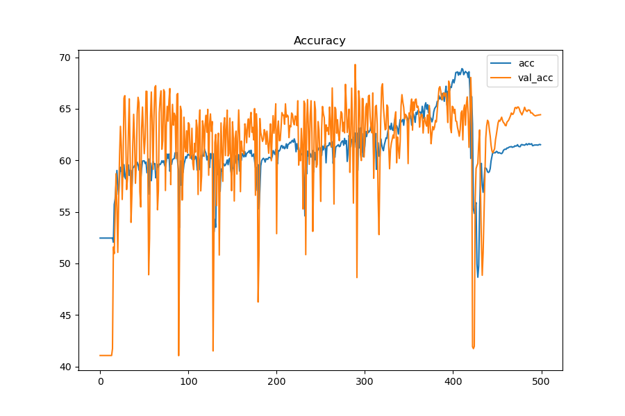

    TweetyNet: Eco-Acoustic Event Detection Pipeline

Introduction to Eco-acoustic Event Detection

 

#####	It is important to understand the health of the planet’s ecosystems in order to help conserve them. One way that has been employed to assess the health of ecosystems is audio event detection, which uses the sound generated by animals to detect their presence and indirectly gauge the health of an ecosystem and is the goal of the TweetyNet machine learning model. Audio event detection has benefited conservation efforts because it allows researchers to automate the task of detecting the presence of birds with the use of machine learning techniques. A brief example of audio event detection in everyday use is hands-free interfacing, which detects the presence of spoken voice commands in order to perform the desired action. Eco-acoustic event detection is audio event detection with the intended use of detecting sounds that are characteristic of an ecosystem and can be used to assess the health of ecosystems. One of the most useful indicators of an ecosystem’s health are bird vocalizations, which are relatively easy to separate from the background noise of an environment. The usefulness of detecting bird presence through their vocalizations presents a challenge, as manual inspection and annotation of audio data is a painstaking process. Through the use of machine learning, we can anticipate a reduction in time spent manually annotating and identifying birds’ vocalizations which will allow researchers to monitor and learn about ecosystems with greater accuracy and efficiency. Birds inhabit and share nearly every environmental niche and are more sensitive to ecological change than other kinds of animals and so are capable of representing the biodiversity of ecosystems disturbed by deforestation and climate change. By applying eco-acoustic event detection to birds, it can also be adapted to the detection of other so-called ‘indicator’ species. Beyond measuring ecological health, eco-acoustic detection can accumulate environmental information, refine our understanding, and reflect on the impact of human activity on our planet’s health. All of these goals are possible applications of the TweetyNet model.
    

    
Methodology

   

##### Machine learning paired with signal processing methods allows for audio data to be processed and learned as image data through conversion to Mel-spectrograms which can be used by TweetyNet, a convolutional and recurrent neural net hybrid model built for the purpose of event detection in audio data. The model has been adapted to use both PyTorch and Tensorflow and has been used to replicate published results that accurately detect the presence of bird vocalizations. Audio files are first converted to spectrograms and normalized, then are passed to the model in order to generate features and truth values. Various efforts have been undertaken in order to increase the performance and usability of the model. Firstly, the model has been adapted to operate on GPUs to improve training speed and performance in results as opposed to training on more general-purpose but slower CPUs. What once took an hour to train on a CPU would take under ten minutes to train using a GPU. With this method, we are able to make use of the DSMLP’s powerful Nvidia GPUs to minimize time spent training the model on large amounts of data. In order to visualize the model’s accuracy, temporal graphs can now be generated for testing data that compares the predicted vocalizations against manually labeled vocalizations for validation. Furthermore, information on whether a prediction was a true positive, true negative, false positive, or false negative can be displayed as well to yield a confusion matrix. Work is currently being done on data ingestion in order to process training data from PyreNote, a browser-based audio annotation tool. We anticipate an improvement in prediction accuracy given the amount of data available and the length of time for those audio files after implementing the ability to train the model on Pyrenote data.

     
Preliminary Results

    

##### Both models parameters were set to 500  epochs with a batch size of 64 and a learning rate of  .005. Aside from speed in training, allowing us to train the model for larger epochs and batch sizes, is an improvement in prediction selectiveness. Predictions resulting from the GPU-adapted model have decreased in False positives and increased in true negatives. As a preliminary result consistent with our model we plan to refine the model to achieve our goal in improving temporal presence rather than the CPU’s general prediction in presence.

    
GPU

   

    
CPU

   



                      
                        

                    
        


